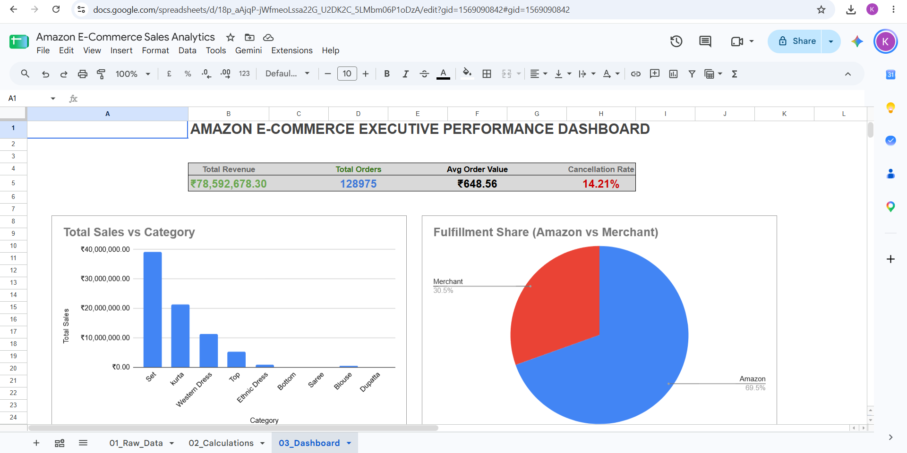
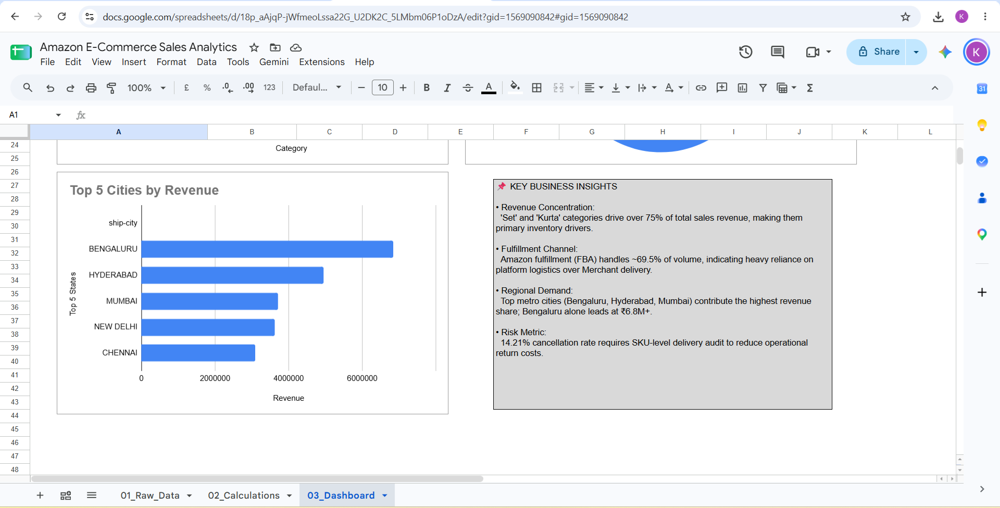

# Amazon E-Commerce Sales Analytics

Comprehensive e-commerce analytics tracking Amazon order fulfillment, delivery statuses, SKUs, and sales trends.

🔗 **[Click Here to View Live Google Sheet Project](https://docs.google.com/spreadsheets/d/18p_aAjqP-jWfmeoLssa22G_U2DK2C_5LMbm06P1oDzA/edit?usp=sharing)**

---

## 📊 Dashboard Previews

---

## 📌 Project Highlights
- Analyzed shipping performance and delivery fulfillment channels (Amazon vs. Merchant).
- Tracked order lifecycle and delivery statuses (Shipped, Delivered, Cancelled).
- Evaluated SKU-level demand, size distributions, and revenue patterns.

## 🛠️ Tools & Techniques
- Google Sheets (Pivot Tables, Formulas & Calculated Fields)
- KPI Metrics & Business Intelligence Dashboards
- E-Commerce Order Fulfillment Tracking)**

